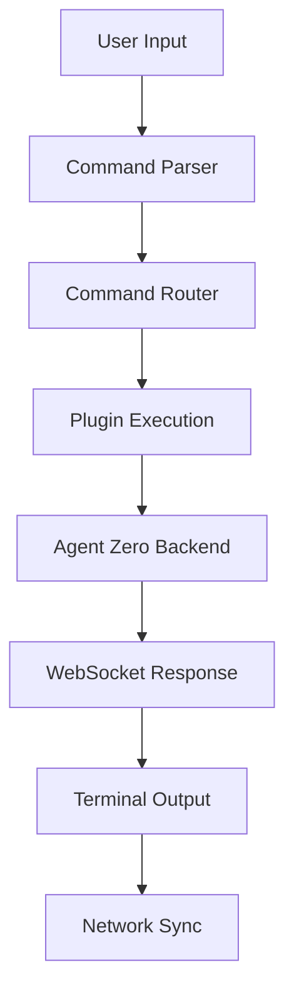
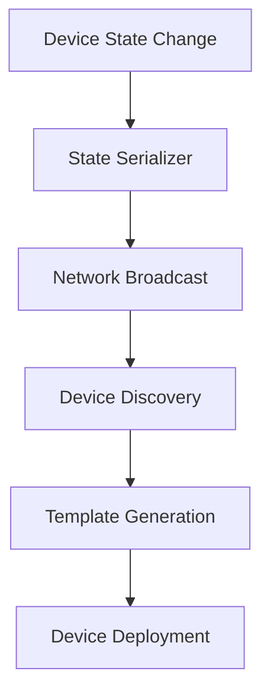
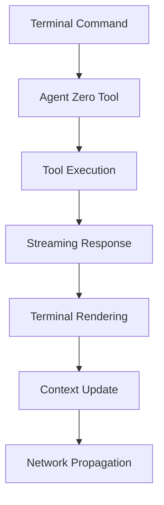

# GOB Platform Architecture

> **Network Intelligence Platform Architecture Overview**  
> System design, patterns, and architectural decisions for GOB's evolution  
> **Version**: 2.0  
> **Last Updated**: 2025-01-06

---

## 🏗️ Architecture Overview

GOB is transforming from a single-interface AI agent to a **Network Intelligence Platform** capable of deploying AI capabilities across multiple devices while maintaining deep Agent Zero integration.

### **Current Architecture (v1.x)**
```
┌─────────────────────────────────────────────┐
│                 GOB v1.x                    │
├─────────────────────────────────────────────┤
│  Alpine.js WebUI (Complex Modal Interface)  │
│  ├── Chat System                           │
│  ├── Settings Management                   │
│  ├── File Browser                          │
│  ├── Task Scheduler                        │
│  └── Notification System                   │
├─────────────────────────────────────────────┤
│           Python Backend                    │
│  ├── Agent Zero Framework Integration      │
│  ├── REST API Layer                        │
│  ├── WebSocket Streaming                   │
│  └── CSRF Protection                       │
└─────────────────────────────────────────────┘
```

### **Target Architecture (v2.x)**
```
┌─────────────────────────────────────────────┐
│        GOB Network Intelligence Platform     │
├─────────────────────────────────────────────┤
│           Terminal UI (Command-Driven)      │
│  ├── Command Router & Parser               │
│  ├── Plugin System (Chat, Files, Tasks)    │
│  ├── Network State Synchronization         │
│  └── Device Template Generator             │
├─────────────────────────────────────────────┤
│         Enhanced Agent Zero Core            │
│  ├── Deep Framework Integration            │
│  ├── Network Intelligence Layer            │
│  ├── Cross-Device Context Management       │
│  └── Tool System Extensions                │
├─────────────────────────────────────────────┤
│          Multi-Device Deployment            │
│  ├── Device Discovery (mDNS)               │
│  ├── Template Generation Engine            │
│  ├── State Synchronization Layer           │
│  └── Network Configuration Management      │
└─────────────────────────────────────────────┘
```

---

## 📋 Architectural Decisions

### **Architecture Decision Records (ADRs)**
All major architectural decisions are documented as ADRs in the `decisions/` directory:

| ADR | Title | Status | Date |
|-----|-------|---------|------|
| **[ADR-001](decisions/ADR-001-terminal-ui-tech-stack.md)** | Terminal UI Technology Stack | ✅ Accepted | 2025-01-06 |
| **ADR-002** | Agent Zero Integration Strategy | 📝 Draft | TBD |
| **ADR-003** | Network Intelligence Architecture | 📝 Planned | TBD |
| **ADR-004** | Device Template Generation System | 📝 Planned | TBD |

---

## 🎯 Core Design Principles

### **1. Agent Zero Compatibility First**
Every architectural decision must preserve and enhance Agent Zero patterns:
- **WebSocket streaming** remains the primary communication method
- **Tool system** integration is seamlessly maintained  
- **Context management** leverages Agent Zero's proven approach
- **Memory systems** work identically to existing Agent Zero patterns

### **2. Network Intelligence Ready**
Architecture designed for multi-device deployment from day one:
- **Component isolation** enables template extraction
- **Event-driven communication** prevents tight coupling
- **State serialization** supports cross-device synchronization
- **Progressive enhancement** adapts to device capabilities

### **3. Terminal-First User Experience**
Command-driven interface optimized for power users:
- **Command parsing** with consistent syntax and aliases
- **Keyboard navigation** as the primary interaction method
- **Performance optimization** for fast terminal responsiveness
- **Help systems** built into the command structure

### **4. Extensibility & Modularity**
Plugin architecture supporting future network features:
- **Plugin lifecycle** with mount/unmount patterns
- **Event bus** for inter-plugin communication  
- **Dependency injection** for testability and flexibility
- **API boundaries** clearly defined and documented

---

## 🔧 System Components

### **Terminal UI Layer**
**Technology Stack**: Vanilla JavaScript + Alpine.js + TypeScript  
**Purpose**: Command-driven interface replacing legacy WebUI

```typescript
// Component Architecture
interface TerminalComponent {
  mount(container: HTMLElement): void;
  unmount(): void;
  handleCommand(command: ParsedCommand): CommandResult;
  getHelp(): CommandHelp[];
}

// Plugin System
interface PluginSystem {
  registerPlugin(plugin: TerminalPlugin): void;
  executeCommand(command: string): Promise<CommandResult>;
  getAvailableCommands(): CommandInfo[];
}
```

### **Agent Zero Integration Layer** 
**Technology Stack**: Enhanced Python backend with Agent Zero framework  
**Purpose**: Deep integration while preserving all existing capabilities

```python
# Agent Zero Extension Pattern
class NetworkIntelligenceExtension(Extension):
    async def execute(self, extension_point: str, **kwargs) -> Any:
        if extension_point == "message_complete":
            await self.sync_across_network_devices(kwargs)
        return await super().execute(extension_point, **kwargs)

# Tool System Enhancement
class NetworkAwareTool(Tool):
    async def execute(self, **kwargs) -> ToolResult:
        result = await super().execute(**kwargs)
        await self.broadcast_tool_result_to_network(result)
        return result
```

### **Network Intelligence Layer**
**Technology Stack**: Python + mDNS + WebSocket synchronization  
**Purpose**: Multi-device discovery, state sync, and template generation

```python
# Network State Management
class NetworkStateManager:
    def __init__(self):
        self.devices: Dict[str, DeviceInfo] = {}
        self.shared_state: Dict[str, Any] = {}
        self.sync_channels: Dict[str, WebSocketChannel] = {}
    
    async def sync_state_across_devices(self, state_update: StateUpdate):
        """Synchronize state changes across all network devices"""
        for device_id, channel in self.sync_channels.items():
            await channel.send_state_update(state_update)
```

---

## 📊 Data Flow Architecture

### **Command Execution Flow**


### **Network Synchronization Flow**


### **Agent Zero Integration Flow**


---

## 🔒 Security Architecture

### **Authentication & Authorization**
- **CSRF Protection**: All state-changing operations require valid tokens
- **Session Management**: Secure session handling with automatic expiration
- **Input Validation**: Comprehensive validation using Zod schemas
- **Output Sanitization**: DOMPurify for all user-generated content

### **Network Security**
- **Device Authentication**: mTLS for inter-device communication
- **State Encryption**: All network state synchronization is encrypted
- **Access Control**: Role-based access for network management functions
- **Audit Logging**: Complete audit trail for all network operations

---

## 📈 Performance Architecture

### **Performance Targets**
| Metric | Current | Target | Strategy |
|--------|---------|--------|----------|
| **Bundle Size** | 500KB | ≤200KB | Tree shaking, code splitting |
| **Load Time** | 800ms | ≤500ms | Optimized assets, lazy loading |
| **Memory Usage** | 80MB | ≤50MB | Efficient state management |
| **Command Response** | 200ms | ≤100ms | Optimized command routing |

### **Performance Monitoring**
```typescript
// Built-in performance tracking
class PerformanceMonitor {
  trackCommand(command: string): PerformanceTracker {
    const tracker = new PerformanceTracker(command);
    tracker.start();
    return tracker;
  }
  
  trackNetworkSync(deviceCount: number): NetworkSyncTracker {
    return new NetworkSyncTracker(deviceCount);
  }
}
```

---

## 🧪 Testing Architecture

### **Testing Strategy**
- **Unit Tests**: 80% coverage minimum for all new code
- **Integration Tests**: Full API and WebSocket testing
- **E2E Tests**: Critical user workflows and command sequences
- **Performance Tests**: Automated performance regression detection
- **Network Tests**: Multi-device synchronization validation

### **Testing Infrastructure**
```typescript
// Standard testing patterns
describe('TerminalCommandParser', () => {
  describe('when parsing commands', () => {
    it('should handle colon-prefixed commands', () => {
      const result = parser.parse(':help');
      expect(result.type).toBe('command');
      expect(result.command).toBe('help');
    });
  });
});
```

---

## 🔄 Deployment Architecture

### **Deployment Pipeline**
1. **Code Quality**: Linting, type checking, formatting
2. **Testing**: Unit, integration, and E2E test suites
3. **Security**: Vulnerability scanning and security tests  
4. **Performance**: Bundle analysis and performance benchmarks
5. **Build**: Production builds for multiple environments
6. **Deploy**: Gradual rollout with feature flags

### **Environment Strategy**
- **Development**: Local development with hot reload
- **Staging**: Production-like environment for testing
- **Production**: High-availability deployment with monitoring
- **Network Devices**: Template-generated deployments

---

## 🔮 Future Architecture Considerations

### **Phase 2: Agent Zero Deep Integration** (Q2 2025)
- Enhanced tool system with network awareness
- Advanced context management across devices  
- Real-time collaboration between network nodes
- Advanced AI orchestration and load balancing

### **Phase 3: Network Intelligence Platform** (Q3 2025)
- Automatic device discovery and configuration
- Intelligent workload distribution across devices
- Advanced network topology optimization
- Machine learning for network behavior prediction

### **Phase 4: Multi-Device Templates** (Q4 2025)
- Automatic UI generation for any device type
- Adaptive interfaces based on device capabilities
- Cross-platform compatibility and optimization
- Enterprise-grade device management features

---

## 📚 Architecture References

### **Internal Documentation**
- **[System Design](system-design/)**: Detailed system design documents
- **[Diagrams](diagrams/)**: Architecture diagrams and flowcharts
- **[Patterns](patterns/)**: Reusable architectural patterns

### **External References**
- **[Agent Zero Framework](../resources/references/agent-zero/)**: Core framework documentation
- **[Network Intelligence Research](../resources/research/)**: Academic and industry research
- **[Best Practices](../resources/best-practices/)**: Industry standards and practices

---

## 🤝 Architecture Governance

### **Architecture Review Board**
- **Lead Developer**: Overall architecture ownership
- **Backend Specialist**: Agent Zero integration and backend design
- **Frontend Specialist**: Terminal UI and user experience  
- **DevOps Engineer**: Deployment and infrastructure architecture
- **Security Engineer**: Security architecture and compliance

### **Decision Process**
1. **RFC (Request for Comments)**: Propose architectural changes
2. **Technical Review**: Architecture review board evaluation
3. **Community Feedback**: Team and stakeholder input
4. **Decision**: Formal architectural decision record (ADR)
5. **Implementation**: Guided implementation with reviews

---

**GOB Architecture Team**  
*Designing the future of network-wide AI intelligence*

---

*For specific architectural decisions and detailed designs, refer to the documents in the respective subdirectories.*
