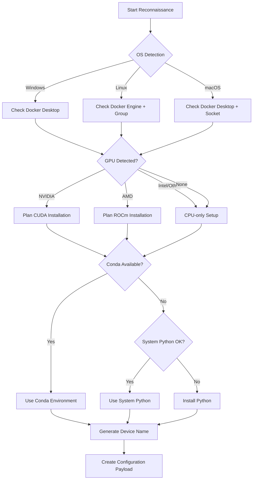

# Agent Zero Reconnaissance Scripts Analysis

## Executive Summary

This document provides a comprehensive analysis of the reconnaissance scripts found in `/home/ds/GOB/ideas/setup/recon_scripts/`. These scripts are designed to perform initial device detection and configuration assessment to inform the Agent Zero setup process.

## 1. Script Inventory

| Script | Purpose | Key Dependencies | Output Format | Lines of Code |
|--------|---------|------------------|---------------|---------------|
| `detect_gpu.py` | Detect GPU hardware across Windows/Linux/macOS | `platform`, `subprocess` | Human-readable text | 50 |
| `detect_os.py` | Identify operating system and version | `platform`, optional `distro` | Human-readable text | 24 |
| `detect_python.py` | Enumerate Python interpreters on PATH | `sys`, `subprocess`, `shutil` | Human-readable text | 29 |
| `detect_conda_mamba.py` | Find Conda/Mamba/MicroMamba installations | `shutil`, `subprocess` | Human-readable text | 49 |
| `detect_docker.py` | Verify Docker installation and daemon status | `subprocess`, `shutil` | Human-readable text | 35 |
| `device_namer.py` | Generate human-friendly device identifiers | `random` | Interactive/programmatic | 24 |

## 2. Detailed Script Analysis

### 2.1 detect_gpu.py

**Purpose**: Cross-platform GPU detection for hardware optimization decisions

**Logic Flow**:
1. Determine OS using `platform.system()`
2. Execute OS-specific commands:
   - **Windows**: `wmic path win32_VideoController get name`
   - **Linux**: `lspci | grep -i 'vga\\|3d\\|2d'`
   - **macOS**: `system_profiler SPDisplaysDataType`
3. Parse and format output for user display

**Key Findings**:
- ✅ Good cross-platform coverage
- ⚠️ Silent failure mode - errors suppressed with empty string return
- ⚠️ Linux command may miss newer GPU types (e.g., compute-only cards)
- ⚠️ No distinction between integrated vs discrete GPUs
- ⚠️ No CUDA/OpenCL capability detection

### 2.2 detect_os.py

**Purpose**: Operating system identification for platform-specific setup paths

**Logic Flow**:
1. Use `platform.system()` for basic OS detection
2. Branch to OS-specific version detection:
   - **Windows**: `platform.release()` and `platform.version()`
   - **macOS**: `platform.mac_ver()[0]`
   - **Linux**: Optional `distro` module for detailed info, fallback to `platform.release()`

**Key Findings**:
- ✅ Clean, simple implementation
- ✅ Graceful degradation when `distro` module unavailable
- ✅ Helpful user guidance for missing dependencies
- ⚠️ WSL detection not specifically handled
- ⚠️ No architecture detection (x86_64 vs ARM64)

### 2.3 detect_python.py

**Purpose**: Python environment discovery for interpreter selection

**Logic Flow**:
1. Report current interpreter (`sys.executable` and version)
2. Search PATH for common Python executable names
3. Execute `--version` on each found interpreter
4. Deduplicate by path to avoid reporting same interpreter multiple times

**Key Findings**:
- ✅ Good deduplication logic
- ✅ Covers common Python naming conventions
- ⚠️ Hardcoded candidate list may miss custom installations
- ⚠️ No virtual environment detection
- ⚠️ No pip availability checking

### 2.4 detect_conda_mamba.py

**Purpose**: Package manager detection for environment setup strategy

**Logic Flow**:
1. Check PATH for `conda`, `mamba`, `micromamba`
2. Execute `--version` for basic availability
3. Run tool-specific info commands:
   - `conda info --json` for base environment detection
   - `mamba/micromamba info` for environment info

**Key Findings**:
- ✅ Comprehensive coverage of Conda ecosystem
- ✅ Attempts to gather environment information
- ⚠️ JSON parsing not implemented (just checks for presence)
- ⚠️ No conda-forge channel detection
- ⚠️ May miss user-specific installations not in PATH

### 2.5 detect_docker.py

**Purpose**: Docker availability and daemon status verification

**Logic Flow**:
1. Check for `docker` CLI in PATH
2. Execute `docker --version` for version information
3. Execute `docker info` to verify daemon connectivity
4. Parse output to determine daemon status

**Key Findings**:
- ✅ Distinguishes between CLI availability and daemon status
- ✅ Clear messaging for different failure modes
- ⚠️ No Docker Desktop vs Docker Engine distinction
- ⚠️ No rootless Docker detection
- ⚠️ No permission/group membership checking

### 2.6 device_namer.py

**Purpose**: Generate memorable device identifiers for multi-device setups

**Logic Flow**:
1. Prompt user for custom device name
2. If no name provided, generate from:
   - Random adjective (10 choices)
   - Random noun (10 choices)  
   - Random 3-digit number
3. Return formatted name

**Key Findings**:
- ✅ Simple, user-friendly approach
- ✅ Reasonable randomization (1000 combinations per adjective-noun pair)
- ⚠️ Limited vocabulary may lead to collisions in large deployments
- ⚠️ No persistence mechanism for generated names
- ⚠️ No validation of user-provided names

## 3. Cross-Platform Execution Matrix

| Script | Windows | Linux | macOS | Privileges Required | Failure Modes |
|--------|---------|--------|-------|-------------------|---------------|
| `detect_gpu.py` | ✅ WMIC | ✅ lspci | ✅ system_profiler | User | Command not found, permission denied |
| `detect_os.py` | ✅ Built-in | ✅ Built-in + distro | ✅ Built-in | User | Missing `distro` module (graceful) |
| `detect_python.py` | ✅ PATH search | ✅ PATH search | ✅ PATH search | User | No Python installations |
| `detect_conda_mamba.py` | ✅ PATH search | ✅ PATH search | ✅ PATH search | User | No conda ecosystem |
| `detect_docker.py` | ✅ Docker Desktop | ✅ Docker Engine | ✅ Docker Desktop | User (+ docker group on Linux) | Docker not installed, daemon not running |
| `device_namer.py` | ✅ Interactive | ✅ Interactive | ✅ Interactive | User | None (pure Python) |

## 4. Gap Analysis

### 4.1 Missing Detection Capabilities

**High Impact**:
- **CPU Architecture**: ARM64 vs x86_64 affects container image selection
- **CUDA/ROCm Drivers**: GPU detection without capability assessment is incomplete
- **Available Memory**: Critical for model size selection
- **Virtualization Status**: Affects Docker nested virtualization and performance

**Medium Impact**:
- **WSL2 Detection**: Different Docker configuration requirements
- **Package Manager**: apt, yum, brew, winget availability
- **Network Connectivity**: Proxy settings, internet availability for downloads
- **Disk Space**: Required for model downloads and container images

**Low Impact**:
- **System Theme**: Dark/light mode for UI preference
- **Display Resolution**: Multi-monitor setup detection
- **Audio Hardware**: Voice input capability assessment

### 4.2 Current Script Limitations

1. **Error Handling**: All scripts suppress errors silently, making debugging difficult
2. **Output Format**: Human-readable text instead of structured data (JSON)
3. **Logging**: No logging framework for troubleshooting
4. **Configuration**: No way to skip certain detections or provide overrides
5. **Testing**: No unit tests for cross-platform validation

## 5. Agent Zero Setup Decision Tree



## 6. Recommended Improvements

### 6.1 Immediate (Week 1)
1. **Add JSON output mode** - Enable programmatic consumption
2. **Implement proper error handling** - Replace silent failures with meaningful errors
3. **Add architecture detection** - Critical for ARM64 support
4. **Create unified runner script** - Execute all probes and aggregate results

### 6.2 Short-term (2-4 Weeks)  
1. **Add CUDA/ROCm detection** - Essential for GPU acceleration
2. **Implement WSL2 detection** - Growing user base
3. **Add memory and disk space checks** - Prevent installation failures
4. **Create configuration override mechanism** - Support edge cases

### 6.3 Medium-term (1-2 Months)
1. **Add comprehensive test suite** - Unit and integration tests
2. **Implement logging framework** - Structured logging with levels
3. **Create GUI probe runner** - User-friendly interface for troubleshooting
4. **Add network connectivity checks** - Proxy and firewall detection

## 7. Proposed Data Contract

```python
{
    "device": {
        "name": "swift-falcon-342",
        "generated": true
    },
    "os": {
        "system": "Linux",
        "release": "6.1.0-9-amd64", 
        "distribution": "Debian GNU/Linux 12 (bookworm)",
        "architecture": "x86_64",
        "wsl": false
    },
    "hardware": {
        "memory_gb": 32,
        "disk_free_gb": 500,
        "cpu": {
            "architecture": "x86_64",
            "cores": 8,
            "features": ["avx2", "sse4_2"]
        },
        "gpu": [
            {
                "vendor": "NVIDIA",
                "model": "GeForce RTX 4090",
                "memory_gb": 24,
                "cuda_version": "12.2",
                "driver_version": "525.60.11"
            }
        ]
    },
    "python": {
        "current": {
            "executable": "/opt/conda/bin/python",
            "version": "3.11.5"
        },
        "available": [
            {
                "executable": "/usr/bin/python3",
                "version": "3.11.2"
            }
        ]
    },
    "package_managers": {
        "conda": {
            "available": true,
            "executable": "/opt/conda/bin/conda", 
            "version": "23.7.4",
            "base_env": "/opt/conda"
        },
        "mamba": {
            "available": true,
            "executable": "/opt/conda/bin/mamba",
            "version": "1.5.1"
        },
        "system": "apt"
    },
    "docker": {
        "available": true,
        "version": "24.0.6",
        "daemon_running": true,
        "user_in_group": true,
        "desktop": false
    },
    "network": {
        "internet": true,
        "proxy": null
    }
}
```

## 8. Implementation Roadmap

### Phase 1: Stabilization (1 week)
- Fix error handling in all scripts
- Add JSON output option
- Create comprehensive test data

### Phase 2: Enhancement (2 weeks)  
- Add missing detection capabilities
- Implement unified runner
- Create configuration override system

### Phase 3: Integration (1 week)
- Integrate with Agent Zero installer
- Add GUI components
- Create troubleshooting documentation

### Phase 4: Optimization (Ongoing)
- Performance improvements
- Additional platform support
- Community feedback integration

---

*Analysis completed on 2025-09-06*
*Scripts analyzed: 6*
*Total lines reviewed: 211*
*Platform coverage: Windows, Linux, macOS*
